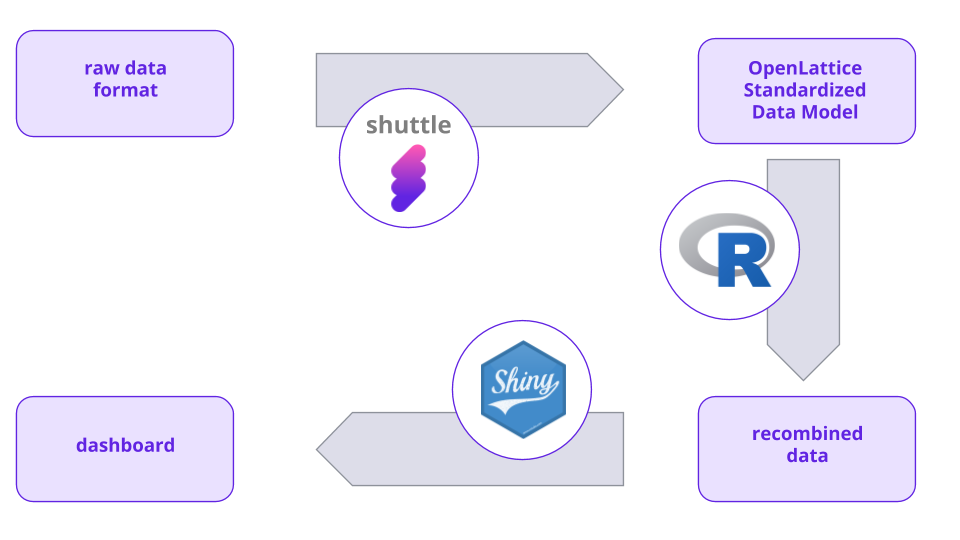
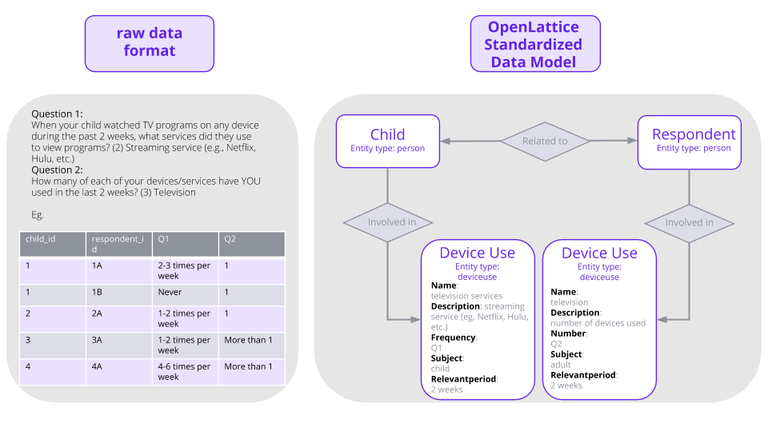
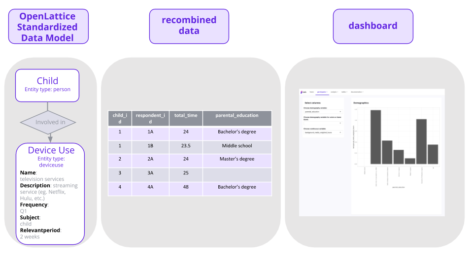

# CAFE

This repository contains code used to analyse data generated within the cafe collaboration. 

Between the raw data, and the CAFE dashboard, there are a number of steps to write, extract, transform and load the data onto the openlattice platform and from the platform to the human readable dashboard.  Below is a schematic representation of the formats the data is presented in, and the tools to transform from one step to the next.

This repository combines sub-repositories that each handle a step between the raw data and the dashboard:
- CAFE-dashboard: the R code of the shiny dashboard
- CAFE-data-analysis: the R code for data transformations between the Open Lattice platform and the recombined data
- CAFE-integrations: the flights to define the relationship from raw data to standardised data model.

## 1. Data integrations

A core principle of the openlattice platform is the graphical entity data model.  Below is an example of how two seamingly unrelated questions share common characteristics (**property types**) that can be grouped in **entity types** (eg. deviceuse).  Individual responses for one of these entity types, are called **entities**.  By connecting the entities through **association types**, we can store the data in a standardised way.

This graphical representation is especially interesting for questionnaires, since it allows for unlimited scaling, while making sure the same information ends up in the same data structure, even if the question is differently asked.

To move the data from the raw form to the Open Lattice model, we use a program called shuttle.  The exact translations are defined in **flights**.  The flights that are currently present in the CAFE-dashboard are in the folder `CAFE-integrations/`.

## 2. Recombining data

### 2a. Pulling and transforming data from the Open Lattice platform

We have a variety of ways to pull the data from the platform into a usable format.  The code in `CAFE-data-analysis` uses the API-clients to recover the data.  We are currently building a system that allows users to directly connect to the database (using for example python, R, tableau,...), which will speed up reading and handling data.

### 2b. Postprocessing data

After having recovered data into a tabular form, we can postprocess the data, using simple column-wise transformations.

For both steps, we use R.

## 3. Visualising data

The Open Lattice platform is ideally suited to share data with collaborators.  By setting permissions (see https://help.openlattice.com), you can allow deidentified sharing, identified sharing, or aggregate sharing.  The dashboard allows researchers to see each others' aggregate data, while keeping the raw data hidden.

The dashboard is written in shiny (R).

